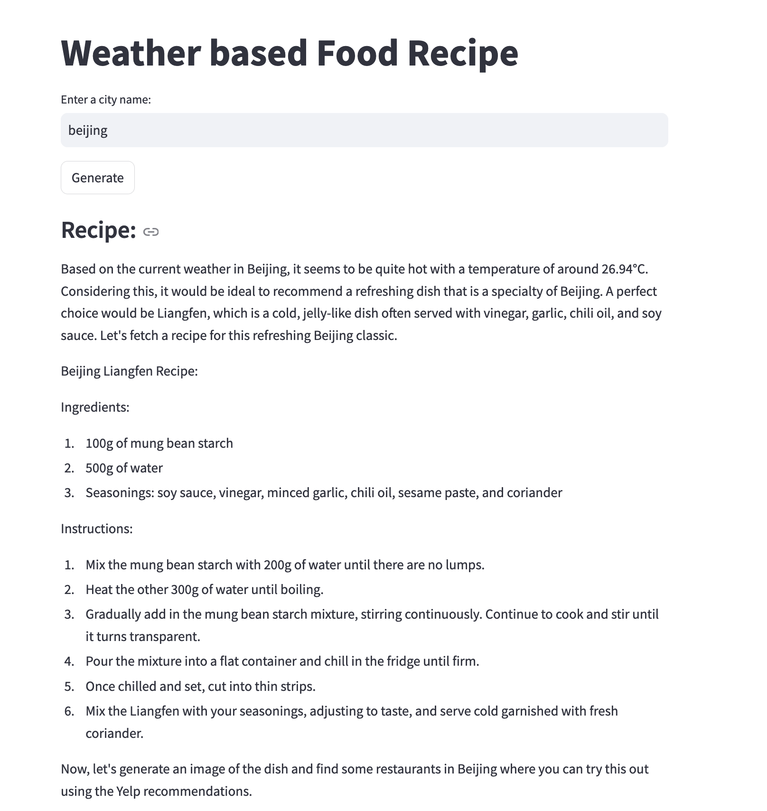
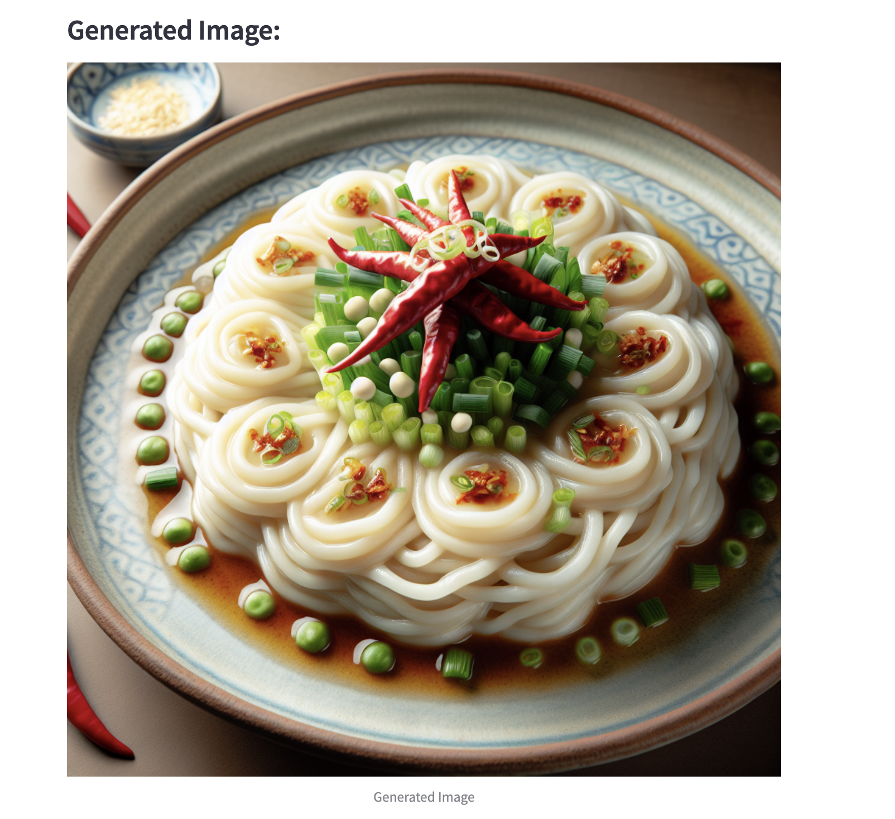
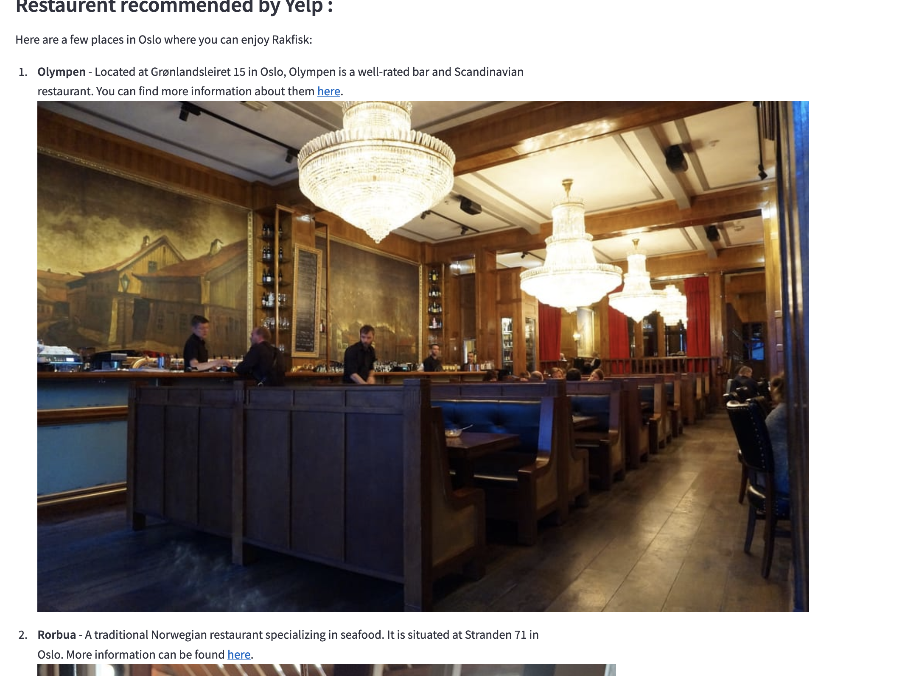

# Food-Recipe-Generator
This project generate a food recipe according to the weather and the city'specialties. We also generate an image with Dall-e and shops recommendations via Yelp Fusion API that let us access all the restaurant from Yelp catalog. We display the result using Streamlit app.

  We use OpenWeatherMap API to get the town's weather conditions. We also use Yelp Fusion API to get restaurant recommendations that serve the recommended food. For the autonomous agent, we use Autogen library from Microsoft Research. We created 3 tools:
- One for the weather API
- One for the Dall-e image generation
- And another for the Yelp recommendation

We  use Python 3.10.9 version for this project.

Command to launch the project : 
- streamlit run main.py --logger.level=debug

# Examples
Here are an example of the result in streamlit :
  <b>For the recipe </b>: 

 <b>For the Dall-e image</b> : 

<b>For the Yelp recommendations</b>:

